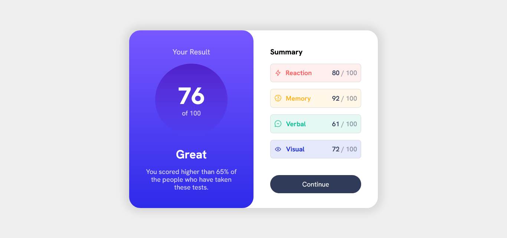
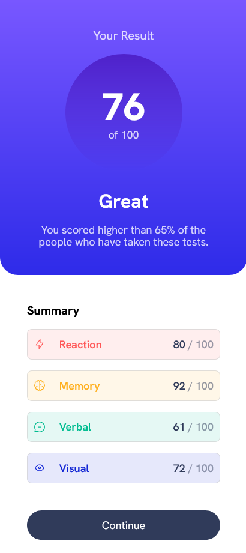

# Frontend Mentor - Results summary component solution

This is a solution to the [Results summary component challenge on Frontend Mentor](https://www.frontendmentor.io/challenges/results-summary-component-CE_K6s0maV). Frontend Mentor challenges help you improve your coding skills by building realistic projects. 

## Table of contents

- [Overview](#overview)
  - [The challenge](#the-challenge)
  - [Screenshot](#screenshot)
  - [Links](#links)
- [My process](#my-process)
  - [Built with](#built-with)
  - [What I learned](#what-i-learned)
  - [Continued development](#continued-development)
  - [Useful resources](#useful-resources)
- [Author](#author)
- [Acknowledgments](#acknowledgments)

**Note: Delete this note and update the table of contents based on what sections you keep.**

## Overview

### The challenge

Users should be able to:

- View the optimal layout for the interface depending on their device's screen size
- See hover and focus states for all interactive elements on the page

### Screenshot





### Links

- Solution URL: [repository](https://github.com/YandroRB/summary-component)
- Live Site URL: [Live Site](https://yandrorb.github.io/summary-component/)

## My process

### Built with

- Semantic HTML5 markup
- CSS custom properties
- Flexbox
- CSS Grid
- Mobile-first workflow

### What I learned

Place a box in the center of the screen.
```css
main{
    min-height: 100vh;
    display: flex;
    justify-content: center;
    align-items: center;
}
```
Make a responsive design with grid
```css
.component{
    display: grid;
    grid-template-columns: repeat(auto-fit,minmax(250px,1fr));
    background-color: white;
    border-radius: 30px;
    box-shadow: 0px 0px 23px 11px rgba(0,0,0,0.1);
    max-width: 670px;
    height: 480px;
    min-width: 320px;
}
```

### Continued development

I would like to be able to add effects to my pages, I would also like to be able to make my pages more optimal.

### Useful resources

- [Grid A complete guide](https://css-tricks.com/snippets/css/complete-guide-grid/) - This page helped me understand how I could make a responsive design with grid.
- [Como centrar cualquier cosa con Css](https://www.freecodecamp.org/espanol/news/centrar-en-html-div-con-css/) - This article describes the different ways to center an element with CSS and which is the most optimal.


## Author

- Frontend Mentor - [@yandrorb](https://www.frontendmentor.io/profile/YandroRB)
